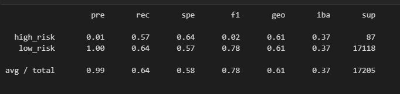
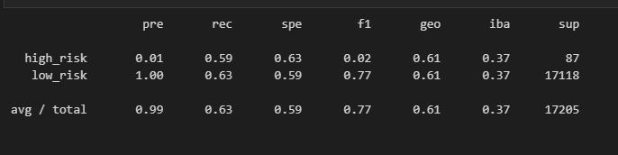
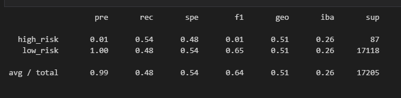
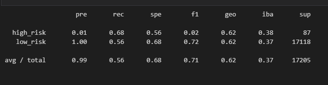
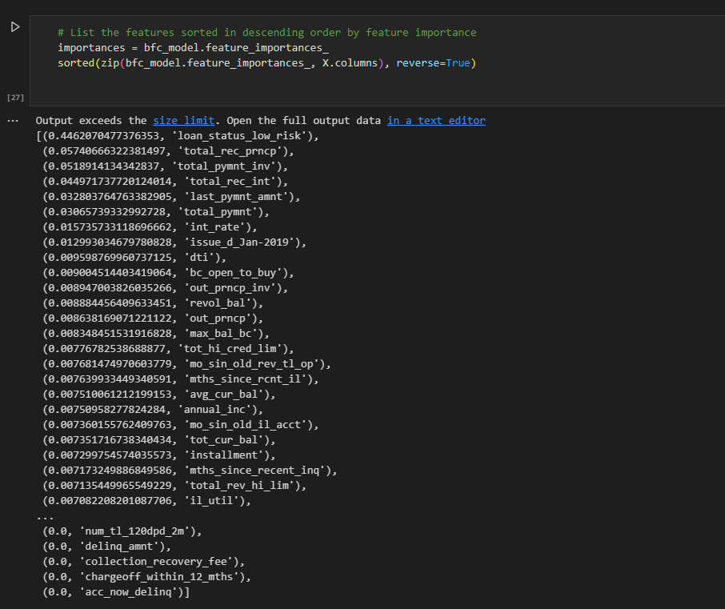
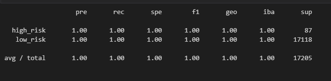

# Module 18

### Overview
The purpose of this analysis was to analyze the credit of an applicant, and use machine learning to determine if an applicant is a high risk or low risk applicant. Our analysis included using Resampling Models, the SMOTEENN Algorithm, and Ensemble Classifiers to assist with our predictive modeling. These algorithms take in variables like Credit Age, Loan Amount, Interest Rate, and other such financial values to asses risk level.

### Methods
We utilized various Resampling Models to assist in our predictive analysis.

#### Oversampling
We first started our analysis by oversampling our data with two methods: Naive Oversampling and SMOTE Oversampling. The results are displayed below

###### Naive Oversampling

###### SMOTE Oversampling

###### Undersampling

###### Combination Sampling

#### Ensemble Learners

###### Balanced Random Forest Classifier

###### Easy Ensemble AdaBoost Classifer

### Results and Discussion

Most of our resampling results return a rec score ~50-70% for the high and low risk categories. All Resampling precision results ended with high risk at 0.01 and low risk at 1. In summary, it appears that our current configuration and data set with the resampling methods are very accurate in predicting low risk applicants, while not so much with high risk applicants. With our recall values being below an ideal of around 80-85%, it appears that the Resampling methods were barely able to correctly identify either high or low risk around half the time.

With regards to our Ensemble Classifiers, were were able to receive much better imbalanced classification reports for both methods used. This is to be expected, as the these algorithms are used to classify variables and attributes of our data to help return features it has determined is the most important for our models based on the data. We were only required to print out the Feature Importance list for the Random Forest Classifier.

The resampling methods need some adjustments to find the right balance of low and high risk detection and identification, and in junction with our Ensemble Classifiers, manual adjustments within our Resampling method functions can lead to better accuracy for both precision in our machine learning model.